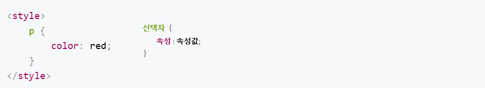
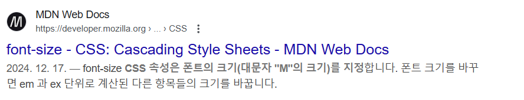
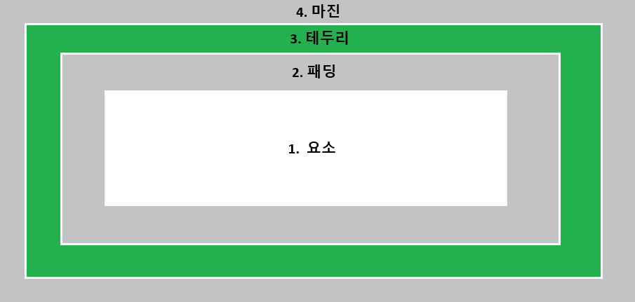

# TO-DO-LIST

1. VS-CODE 다운로드
    - Auto Close Tag 확장프로그램 설치
    - HTML Snippets
    - Live Server
    - Material Icon Theme
    - Prettier - code formatter

# HTML

## 1. 태그들

> `<!-- 주석 -->`

- `<hr/>` : 수평선 긋기
- `<br/>` : 줄바꿈 
- `<p>`태그와 `<pre>` 태그의 차이점 알기
- 그 외 스타일 태그 
```html
<!DOCTYPE html>
 
<html>
<head>
    <meta charset="utf-8" />
    <title></title>
</head>
<body>
    <h3>텍스트 꾸미기</h3>
    <hr/>
    <b>진하게:b</b><br>
    <strong>중요한:strong</strong><br>
    <em>강조:em</em><br>
    <i>이탤릭으로 강조:i</i><br>
    <b><i>진하게 이탤릭으로 강조</i></n><br>
    보통 문자보다 <small>한 단계 작은 문자:small</small><br>
    보통 문자보다 <big>한 단계 큰 문자:big</big><br>
    <del>삭제:del</del><br>
    <s>취소선:s</s><br>
    <ins>추가>ins</ins><br>
    <u>언더라인:u</u><br>
    일반적으로 del과 ins를 같이 <del> 적용</del><ins>사용</ins><br>
    보통문자의 <sup>위첨자:sup</sup><br>
    <mark>하이라이팅:mark</mark><br>
</body>
</html>
```

- `<a>`태그의 target
    - _blank : 새로운 탭으로 열어준다
    - _self : 현재 탭으로 열어준다
    - _parent : 부모 프레임에서 열림 (프레임(iframe) 내부에 있을 때만 동작)

- `<iframe>` 이란? 
    > inline frame의 약자. 다른 HTML 페이지를 현재 페이지에 포함시키는 중첩된 브라우저.

- `<a>` 태그로 html 문서 내에 이동하기


## 2. HTML 문자 엔티티
> HTML에서 특수 문자(예: <, >, &)를 그대로 쓰면 웹 브라우저가 HTML 태그로 인식할 수 있어,
이럴 때 문자 엔티티(HTML Entity) 를 사용하면, 원하는 문자를 안전하게 표시할 수 있습니다.

주로 많이 사용하는 엔티티
- `&lt;` : <
- `&gt;` : >
- `&nbsp;` : ''(공백, Space 한칸)
- `&amp;` : &
- `&quot;` : "


```html
<!DOCTYPE html>
<html>
<head>
    <title>문자, 기호, 심볼 표현</title>
</head>
<body>
    <h3> 기호넣기</h3>
    <hr/>
    10 &divide;2=5<br>
    &radic;2=1.414<br>
    2 &nbsp;&nbsp; &lt; &nbsp;&nbsp;&nbsp;&nbsp;3<br>
    오늘 &quot;Elvis&#34; 노래를 들었다.
    <hr>
    &lt;추가&gtl<br>
    &bull;화살표<br>
    &larr;왼쪽 화살표<b> &amp;larr;</b><br> 
    &rarr;오른쪽 화살표 <b> &amp;rarr;</b><br>
    &uarr;위쪽 화살표 <b> &amp;uarr;</b><br>
    &darr;아래쪽 화살표 <b> &amp;darr;</b><br>
    &harr;좌우 화살표 <b> &amp;harr;</b><br>
    &lArr;왼쪽 이중화살표 <b> &amp;lArr;</b><br>
    &rArr;오른쪽 이중화살표 <b> &amp;rArr;</b><br>
    &uArr;위쪽 이중화살표 <b> &amp;uArr;</b><br>
    &dArr;아래쪽 이중화살표 <b> &amp;dArr;</b><br>
    &hArr;좌우 이중화살표 <b> &amp;hArr;</b><br>
    <hr>
    &bull; 비교<br>
    &ne; 같지 않다. <b>&amp;ne;</b><br>
    &le; 작거나 같다. <b>&amp;le;</b><br>
    &ge; 크거나 같다. <b>&amp;ge;</b><br>
    <hr>
    &bull; 기타<br>
    &bull; 불릿표시 <b>&amp;bull;</b><br>
    &copy; copyright <b>&amp;copy;</b><br>
    &reg; registered trade mark <b>&amp;reg;</b><br>
    &trade; trade mark <b> &amp;trade;</b><br>
    &and; and <b> &amp;and;</b><br>
    &or; or <b> &amp;or;</b><br>
    &cup; 합집합 <b>&amp;cup;</b>><br>
    &cap; 교집합 <b>&amp;cap;</b><br>
</body>
</html>
```
다음과 같은 HTML 문자 엔티티가 있다!  
하지만 요즘 웹에서는 `UTF-8` 덕분에 문자 엔티티를 덜 쓰게 되었다.

##  3. UTF-8 이란?
UTF-8(Unicode Transformation Format - 8-bit) 은 전 세계 모든 문자를 표현할 수 있는 문자 인코딩 방식.  
이걸 사용하면 한글, 일본어, 중국어, 이모지 등 다양한 문자를 깨지지 않고 표시할 수 있습니다.

# CSS 알고가기

## CSS가 무엇인가? 

만든 HTML 페이지를 더 예쁘게 꾸미고 싶다면 CSS를 배울 차례!  
CSS는 HTML 문서를 시각적으로 꾸미는 언어입니다. 왜 HTML에 꾸미기 기능을 넣지 않고 CSS 를 별도로 만들었을까요?  
> HTML 코드와 꾸미기 코드를 분리하면 가독성과 효율성 모두 높아지기 때문입니다! 즉, 코드 관리를 쉽게하기 위해서

## CSS 적용하기

가장 쉬운 방법! 이 방법은 긴 CSS 코드를 작성할 땐 추천드리지 않습니다만 간단하게 스타일을 적용해볼 수 있는 방법입니다.  
바로 HTML에 style 태그를 사용하는 거에요.
```html
<style>

</style>
```

- p 태그에 빨간 글씨색 넣어보기
```html
<style>
    p {
        color: red;
    }
</style>

<h1>What is CSS?</h1>
<p>
    Cascading Style Sheets is a style sheet language used for describing the presentation of a document written in a markup language such as HTML.
</p>
```


### style 태그 살펴보기




### 태그 안에 스타일 태그 넣는 방식

```html
<p style="color:red;">난 빨간색이야</p>
```
하지만 p 태그를 여러번 사용하면 비효율적이므로, style 태그안에 색깔 속성을 지정해줍시다!  
> 코딩을 잘하는 원칙. '반복 작업'을 하지 않는 것. 코드를 중복되지 않게 효율적으로 작성하면 컴퓨터 조차도 비용을 절약, 코드도 절약!


### 외부 CSS 파일 적용하기

style 태그 안에 CSS 를 적용하는 방법을 알아보았습니다. <ins>하지만 이 방법은, 효율적이지 않습니다!</ins>  
코드가 길어질 수록 HTML 파일 길이도 길어지기 때문입니다.  
그래서, <mark>CSS 파일을 별도로 두고, HTML 안에 삽입을 해줄 것입니다.</mark>

```html
<!DOCTYPE html>
<html>
<head>
    <meta charset="utf-8" />
    <title>스타일 시트 적용하기</title>
    <link rel="stylesheet" href="style.css" />
</head>
<body>
    <h1>What is CSS?</h1>
    <p>
        Cascading Style Sheets is a style sheet language used for describing the presentation of a document written in a markup language such as HTML.
    </p>
</body>
</html>
```

`link` 태그는 외부 자원을 링크할 때 사용합니다. 여기서 stylesheet는 링크할 문서 형식, style.css는 파일명입니다.

|패턴|설명|
|------|---|
|link|현재 문서와 외부 리소스의 관계를 명시합니다.|
|rel|현재 문서와 연결한 리소스의 관계를 설명합니다.|
|href|연결할 리소스의 URL 입니다.|

## CSS 속성 사용해보기

### CSS 속성은 어떻게 찾나요?

글씨 크기를 변경하고 싶은데 어떻게 변경해아하나요? 할때는 검색하는 방법을 알려드릴게요.  
> 'CSS 글씨 크기 속성' or 'CSS font size property'라고 검색해보세요.



MDN은 모질라 재단이 제공하는 웹 기술 문서를 모아놓은 곳입니다. 객관적이고 좋은 정보가 많으니 검색 시, MDN이라는 글자가 보이면 확인해보세요!

### CSS 적용해보기

- font-size : font 사이즈
- text-align : 글씨 정렬 (가운데 정렬)


## CSS 선택자

CSS 선택자(selector)는 HTML에 스타일을 적용할 때 HTML 요소를 지정하는 역할을 합니다.  

여기서 질문! 내가 작성한 p 태그 중 첫 p 태그만 CSS를 적용하고 싶을떈 어떻게 해야할까요?
> 선택자를 이용하면 해결할 수 있습니다!

### 선택자를 사용하는 5가지 방법
1. 전체 선택자
2. 유형 선택자
3. 아이디 선택자
4. 클래스 선택자
5. 복합 선택자

### 1. 전체 선택자

HTML 문서에 모두 적용시킵니다.

```css
* {
    color: red;
}
```

### 2. 유형 선택자

우리가 배운 선택자입니다. 특정 태그를 지정해 작성하는 방식입니다. 

```css
p {
    color: red;
}
```

### 3. 아이디 선택자

아이디로 요소를 식별해주는 선택자입니다. 
```html
<style>
    #here {
        color: red;
    }
</style>

<p id="here">텍스트</p>
```
여기서 id는 중복되지 않는 고유한 값이어야 합니다. 

> 실습! 첫번쨰 p태그에만 색상을 지정해보세요.

### 4. 클래스 선택자

클래스 선택자는 특정 클래스에 속하는 요소를 선택합니다. 여기서 클래스란 요소의 목록을 말합니다.  
아이디와 비슷한 기능을 하지만, 클래스는 여러 태그를 하나의 클래스로 묶을 수 있고, 한 태그에 여러 클래스 이름을 붙여줄 수도 있습니다. 

보통 아이디 선택자보다 클래스 선택자를 많이 사용합니다. 

```html
<style>
    .container {
        backgroud-color: cadetblue;
    }
</style>

<p class="container">paragraph 1</p>
```

### 5. 복합 선택자

부모와 자식 태그가 복합적으로 쓰인다고 보면 됩니다.
> 자손 선택자, 자식 선택자, 인접 형제 선택자, 일반 형제 선택자 등 많은 것이 있지만, 가장 많이 사용하는 자손 선택자를 배우겠습니다.

```css
조상 자손 {
    속성
}
```

```html
<!DOCTYPE html>
<html>
<head>
    <meta charset="utf-8" />
    <link rel="stylesheet" href="style.css"/>
</head>
<body>
    <h1>Heading</h1>
    <div>
        <p>child1</p>
        <p>child2</p>
        <div>
            <p>grandchild</p>
        </div>
    </div>
    <p>neighborhood child</p>
</body>
</html>
```
```css
div p {
    color: red;
}
```

## CSS 배치 속성

배치 속성은 CSS 레이아웃과 관련된 것입니다. 예제를 통해 확인해보겠습니다.

```html
<!DOCTYPE html>
<html>
<head>
    <meta charset="utf-8" />
    <link rel="stylesheet" href="style.css"/>
</head>
<body>
    <h1>Emotion</h1>
    <span>SAD</span>
    <span>HAPPY</span>
    <span>LOVE</span>
</body>
</html>
```
```css
h1, span {
    border: 3px solid red;
} /* 테두리굵기 선스타일 색상 */
```

`<span>`태그는 줄바꿈을 하지 않고 구문 요소를 의마하는 태그입니다.

결과를 보면, h1 태그는 가로화면 전체를 둘러싸고 있습니다. 반면, span 태그 테두리는 요소 크기에 맞춰졌습니다.  
h1 태그 처럼 요소의 가로줄 전체를 차지하는 요소를 <mark>블록 레벨 요소</mark>라 부르고,  
span 태그와 같이 요소 크기만큼의 너비를 차지하는 요소를 <mark>인라인 레벨 요소</mark>라고 부릅니다.


### 블록 레벨 요소 vs 인라인 레벨 요소

모든 HTML 요소에는 `display`라는 속성이 있고, 그 기본값이 블록 또는 인라인으로 설정되어있습니다.
- 블록 레벨 요소 : 요소가 있는 가로줄 전체를 차지 ex) h
- 인라인 레벨 요소 : 요소가 있는 공간만 차지 ex) span

그럼 특정 태그의 display를 바꾸고 싶다면? css에 display 속성에 원하는 속성값을 지정해주면 됩니다! 

> CSS display 검색!

#### 1. display: block;
▶ 특징
- 한 줄 전체를 차지(줄 바꿈이 자동으로 발생).
- 너비(width), 높이(height), 마진(margin), 패딩(padding) 설정 가능.
- 대표적인 블록 요소: `<div>, <p>, <h1>~<h6>, <section>, <article>` 등.

#### 2. display: inline;
▶ 특징
- 내용만큼만 너비를 차지하고, 줄 바꿈이 발생하지 않음.
- width, height 값이 적용되지 않음. (패딩과 마진도 일부만 적용됨)
- 대표적인 인라인 요소: `<span>, <a>, <strong>, <em>, <b>, <i>` 등.

#### 3. display: inline-block;
▶ 특징
- inline처럼 한 줄에 여러 개 배치 가능 (줄 바꿈 없음).
- block처럼 width, height, margin, padding 적용 가능.
- 대표적인 요소: `, <button>, <input>` 등.


## 박스 모델 : 마진, 테두리, 패딩

블록과 인라인이라는 개념은 왜 존재할까요? 바로 보기 좋게 배치하기 위해서입니다 :)  
요소를 원하는 곳에 배치하려면 태그마다 가지고 있는 특성을 알아야 합니다. 

이때, 블록과 인라인 요소 외에도 레이아웃을 정하는 HTML 요소가 있습니다. 바로 <mark><b>박스모델</b></mark> 입니다!

박스모델은, `요소`, `패딩[padding]`, `테두리[border]`, `마진[margin]` 으로 구성되어 있습니다.



1. 요소 : 텍스트, 사진 등 보여줄 대상
2. 패딩 : 요소 주변 영역을 감쌉니다. 해당 부분은 투명입니다.
3. 테두리 : 요소와 패딩을 감싸는 테두리입니다.
4. 마진 : 테두리 밖의 영역을 감쌉니다.해당 부분은 투명입니다. 