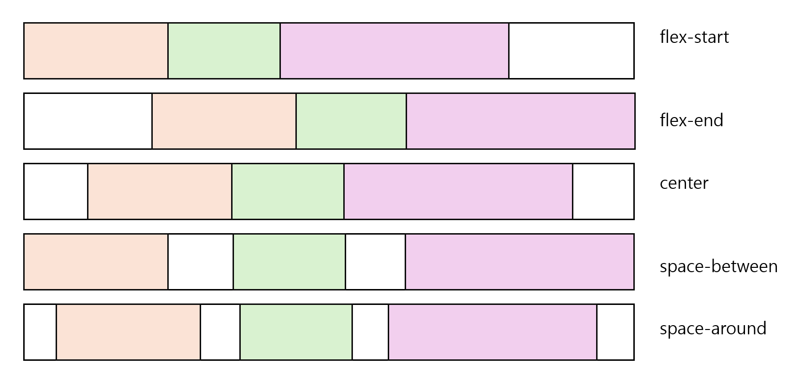
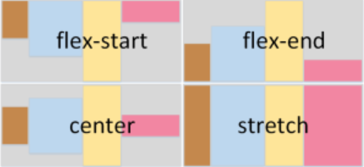
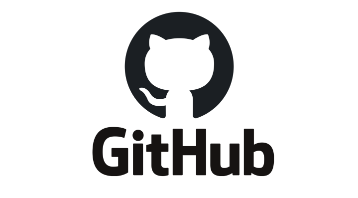

# CSS 배치속성과 반응형 웹

- 학습 목표 : CSS 배치 속성을 학습하고, 반응형 디자인이란 무엇인지, CSS 배치 속성을 활용해 알아보겠습니다.
- 학습 순서 
    1. 배치 속성이 뭐야? (20250222 학습)
    2. 박스 모델: 마진, 테두리, 패딩 (20250222 학습)
    3. 실습: 반응형 웹 페이지 만들기
- CSS 배치 속성 : 배치속성을 이용해 원하는 위치에 요소를 배치할 수 있습니다. CSS 레이아웃 속성과 마진, 테두리, 패딩 등이 있습니다.
- 반응형 웹 : 많은 사이트가 다양한 화면 크기에 맞춰 자동으로 요소를 배치하는 반응형 웹을 사용합니다. '화면 크기에 반응하니까 반응형이구나'라고 알면 되겠죠?

## 배치 속성

#### 1. display: block;
▶ 특징
- 한 줄 전체를 차지(줄 바꿈이 자동으로 발생).
- 너비(width), 높이(height), 마진(margin), 패딩(padding) 설정 가능.
- 대표적인 블록 요소: `<div>, <p>, <h1>~<h6>, <section>, <article>` 등.

#### 2. display: inline;
▶ 특징
- 내용만큼만 너비를 차지하고, 줄 바꿈이 발생하지 않음.
- width, height 값이 적용되지 않음. (패딩과 마진도 일부만 적용됨)
- 대표적인 인라인 요소: `<span>, <a>, <strong>, <em>, <b>, <i>` 등.

지난번에 이어서 배치 속성을 살펴보겠습니다. 블록 레벨 요소를 인라인 레벨 요소로 바꿔볼까요?

> block_test.html에 적용해보아요
```html
<style>
    h1 {
        border: 3px solid red;
    }
</style>
```

그럼 이번엔 인라인 레벨 요소를 블록 레벨 요소로 바꿔볼까요?

```css
h1,
span {
    border: 3px solid red;
    display: block;
}
```

## 박스모델 

### border 로 밑줄 쳐보기

1. Emotion 텍스트와 그 아래 감정을 나열한 텍스트 사이에 구분선이 있었으면 좋겠어요~ (border)
2. 그리고 SAD, HAPPY, LOVE 사이에 간격이 넓었으면 좋겠습니다! (padding 혹은 margin 사용~)

```css
h1 {
    border-bottom: 1px solid black;
}
```

## 반응형 웹페이지 만들기

오늘날 다양한 태블릿과 스마트폰이 출시되고 있습니다. 이에 따라 화면 크기도 제각각입니다.  
웹 페이지를 디자인 할때 각 다양한 화면에 대응해야겠죠?

그래서 반응형 디자인을 사용합니다. 반응형 디자인이란 화면 해상도에 따라 HTML과 CSS를 자동으로 맞춰서 보여주는 기능을 말해요.

어떻게 만들까요? 바로 `미디어 쿼리`를 사용하면 됩니다.
`Media Query`는 사이트에 접속하는 미디어 타입과 특징에 따라 다른 CSS 스타일을 적용하도록 도와주는 규격입니다.

예를들어, 작은 해상도에 맞게 텍스트 크기를 조정하거나, 페이지를 새로모드로 볼 때 단락 사이의 패딩을 늘리거나, 버튼 크기를 늘릴 수 있습니다.

#### @media 사용법
```css
@media (color) {...}
```
- @media : 미디어 쿼리
- color : 적용할 속성
- {...} : 적용값

#### @import

다른 스타일 시트에서 스타일 규칙을 가져올 때 사용합니다.
예를들어
```css
@import url("hello.css");
@import 'hello.css';
```

@import는 반드시 문서 최상단에 있어야합니다.
코드는 위에서 아래로 해석되고 실행됩니다. 그러므로 사용할 파일을 최상단에서 먼저 불러와야 불러온 파일 내용을 이용하는 코드가 동작할 수 있습니다.


### 배경색 지정하기: background-color 태그

화면 너비에 따라 배경색이 바뀌는 반응형 웹 페이지를 만들어 보겠습니다.
#### 1. 원하는 색깔을 배경색으로 지정해보세요.
```css
<style>
    body{
        background-color: pink;
    }
</style>
```

#### 2. 너비에 따라 색깔을 지정해볼게요.
```css
@media (max-width:1280px) {
    body {
        background-color:pink;
    }
}

@media (max-width: 600px) {
    body {
        background-color:olive;
    }
}
```

테스트해보세요! 
> 너비를 확인하는 방법은, 개발자 도구를 키면, 마우스로 창크기를 변경할때마다 오른쪽 상단에 보여요!  


# CSS 레이아웃 : 플렉스박스

- 학습 목표 : CSS의 꽃이라고 할 수 있는 레이아웃을 배워볼 거에요. 여기서 말하는 레이아웃은 이미지, 텍스트 등을 원하는 위치로 배치하는 거랍니다.
- 학습 순서
    1. 플렉스가 필요한 순간?
    2. 플렉스박스로 정렬하기
    3. 블렉스 축 방향 바꾸기 : flex-direction
- 플렉스박스는 복잡한 계산 없이 요소 크기와 순서를 유연하게 배치할 수 있어요.

## 플렉스는 언제 필요할까요?

`flex.html` 파일을 실행해볼게요!  
div로 정사각형 3개를 만들어 보았어요. 자, 여기서 div 박스가 나란히 있지않고 줄바꿈이 되는 이유는 뭘까요?

개발자도구로 확인하면 정사각형 오른쪽은 margin이 차지하고있어요~ margin을 없앨 수 있을까요? 

네! <ins>플렉스 박스를 사용하면 됩니다.</ins> (물론 inline으로 바꿔도 가능하지만, 플렉스박스를 사용할게요)

### flex 박스로 정렬하기
플렉스 박스는 여백을 없앨 뿐만 아니라, 축을 변경한다든지, 자식간의 정렬을 가운데로 맞출 때에도 사용합니다.
즉 유연하게 박스 레이아웃을 변경할 수 있어요.

- 플렉스 박스 제 1원칙 : <b>'부모만이 플렉스할 수 있다.'</b>
부모에 적용해야 자식이 영향을 받습니다.

#### 적용방법
```css
body {
    display: flex;
}
```

- 공간에 맞추기 = `display flex`  

### 주축 정렬하기 : justify-content

`justify-content` 속성은 웹 페이지의 축(주축, 교차축)을 따라 요소 사이에 공간을 만드는 방법을 정의합니다.
주축은 가로를, 교차축은 세로를 기본값으로 가집니다. 

- `flex-start` : 시작 부분에 정렬
- `flex-end` : 끝에 정렬
- `center` : 중앙에 정렬
- `space-between` : 요소가 축을 따라 펼처 집니다. (각 요소 사이에 공간이 있음)
- `space-around` : 요소가 축을 따라 펼쳐지지만 가장자리 주변에도 공간이 있습니다.



#### 주축을 가운데로 정렬해보기
```css
body{
    display: flex;
    justify-content:center;
}
```

나머지 속성들도 실습해보기 !

### 교차축 정렬하기 : align-items

세로축을 정렬합니다!

- `stretch` : 요소의 길이와 교차축의 길이를 같게 함
- `flex-start` : 시작 위치에 정렬
- `flex-end` : 끝 정렬
- `center` : 중앙 정렬



flex_align.html 참고 


# 깃/깃허브 배우기

  
`GIT`은 문서나 소스 코드 같은 파일의 변경 이력을 관리해주는 시스템입니다. 파일 내용을 수정해 저장해도, 
필요하면 수정 전 내용을 언제든 다시 확인하거나 복원할 수 있습니다. 
이런 시스템을 일컬어 버전 관리 시스템(version-control system)이라고 합니다.

## 1. 깃 설치하기

1. 깃 홈페이지 접속(git-scm.com)
2. Download 2.48.1 for Windows 를 클릭해 실행 파일을 다운로드
3. 깃 설치

깃허브와 VSCode는 연동시킬 수 있습니다 !

## 깃허브가 왜 필요한가요?

우리는 코드를 열심히 저장합니다. 날리면 안되니까요. 혼자 작업할 때는 내 PC에 코드를 저장해도 되지만, 협업할 때 팀원들이 각자의 PC에 따로따로 관리하면 서로의 코드를 확인하기 어렵습니다.
이럴 때 깃허브를 공동 저장소로 사용하면 유용합니다.

### github 이란 무엇인가? 
github 은 git 으로 관리되는 프로젝트의 코드가 저장되는 저장소이다! 쉽게 말해 우리가 파일을 구글 드라이브에 보관하듯이, 
코드를 github 에 보관한다고 생각하면 된다.

github 을 이용하게 되면 컴퓨터에 있는 코드가 모종의 이유로 소실되더라도 원본 코드를 지킬 수 있고, 배포를 할 때에도 활용할 수 있다.

## 2. GITHub 회원가입하기

1. https://github.com 사이트 접속
2. sign up 클릭

## 3. git/github 핵심 개념 알아보기

깃/깃허브를 다루려면 몇가지 개념을 알아야 해요. 저장소, 브랜치, 클론, Add > Commit > Push, Pull 정도 알면 초보자로서 기본 사용은 할 수 있습니다!

### 저장소
repositories는 저장하는 공간을 말해요. 저장소에 폴더 및 모든 유형의 파일(Html, Css, Javascript, 문서, 데이터, 이미지)을 저장할 수 있습니다.

### 브랜치
github branch는 버전별 저장소입니다. 기본적으로 저장소에는 main 브랜치가 있습니다. 우리는 메인 브랜치에서 작업해보겠습니다 ! 
(협업할떄 주로 자신의 브랜치를 만들어서 사용하고 병합하는 형식)

### clone
클론은 깃허브 저장소에 있는 파일들을 로컬 컴퓨터로 복사본을 만드는 작업을 말합니다.  
이때 클론은 파일을 받는 과정을 말합니다. 다음과 같이 Git Bash에 클론 명령을 입력하면 됩니다. (뒤에 진행할거에요!)

```bash
git clone https://github.com/kongemom1215/coding_basic.git
```

### ADD > COMMIT > PUSH

클론은 파일을 받는 과정입니다. 그러면 저장소에 파일을 올리는 과정은 뭐라고 할까요? 깃허브에서는 변경사항을 `Commit`이라고 합니다.  
Commit이 저지르다라는 뜻을 가지고 있는데 우리는 깃허브 저장소에 무언가를 저지르는 겁니다.  
커밋 과정은 ADD > COMMIT > PUSH 순서로 명령을 수행해 이루어집니다.  
내 코드를 ADD 하고, 저지르고(commit), 저장소에 밀어넣는(push) 거죠.

### PULL

마지막으로 풀을 알아보겠습니다. pull은 당기다라는 의미죠? 따라서 풀은 깃허브 저장소에 있는 파일을 가져오는 작업을 말합니다. 
클론과 비슷하죠? 하지만 다릅니다!
`clone`은 처음 코드를 다운로드 할 때 사용하고, `pull`은 그 이후에 사용합니다. 

## 4. [실습] 깃허브 사용하기

1. 저장소 만들기
2. 클론하기
3. 파일 추가하기
4. 커밋 및 푸시하기
5. 풀하기 

#### git 실행
```bash
git init
git remote add origin 주소
git branch -M main
git push -u origin main
```

#### 로컬에 사용자 등록
```bash
git config --global user.name "사용자명"
git config --global user.email "이메일주소"
```

#### VSCOde 플러그인 다운받기 : github pull requests and issues
