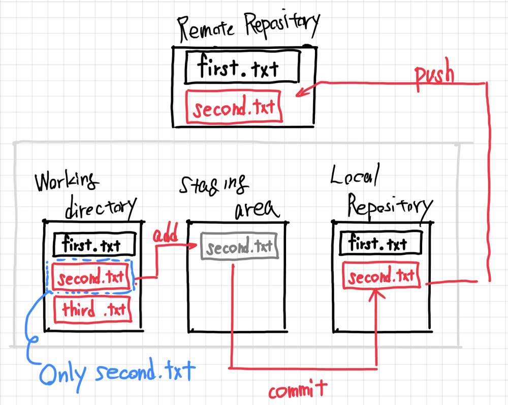

# 정리

## HTML 기본 문법 정리
HTML은 **tag**를 사용해서 문서를 구조화하는 마크업 언어입니다.
태그는 
    - 여는 태그(`<태그명>`) 
    - 닫는 태그(`</태그명>`)
    - 내용 
으로 이루어져 있습니다.
일부 태그는 내용없이 닫는 태그없이 사용할 수 있어요!

### (1) HTML 기본 구조
```html
<!DOCTYPE html>
<html>
<head>
    <meta charset="UTF-8">
    <title>웹 페이지 제목</title>
</head>
<body>
    <h1>제목</h1>
    <p>문단 내용</p>
</body>
</html>
```
✔ `<!DOCTYPE html>` : HTML5 문서임을 선언  
✔ `<html>` : HTML 문서의 시작과 끝  
✔ `<head>` : 페이지 정보를 담는 부분 (제목, 메타 정보, CSS, JS 포함 가능)  
✔ `<body>` : 실제 화면에 보이는 콘텐츠를 담는 부분  

### (2) 주요 태그 정리 

📌 텍스트 태그
```html
<h1>제목 1</h1>  <!-- h1 ~ h6: 제목 크기 -->
<p>문단</p>      <!-- 문단 -->
<b>굵게</b>      <!-- 굵은 글씨 -->
<i>기울임</i>    <!-- 기울어진 글씨 -->
<u>밑줄</u>      <!-- 밑줄 -->
```

📌 링크 & 이미지
```html
<a href="https://www.google.com">구글로 이동</a>  <!-- 링크 -->
  <!-- 이미지 -->
```

📌 목록 태그
```html
<ul>  <!-- 순서 없는 목록 -->
    <li>항목 1</li>
    <li>항목 2</li>
</ul>

<ol>  <!-- 순서 있는 목록 -->
    <li>첫 번째</li>
    <li>두 번째</li>
</ol>
```

📌 입력 폼
```html
<input type="text" placeholder="이름 입력">  <!-- 텍스트 입력 -->
<input type="password">  <!-- 비밀번호 입력 -->
<button>버튼</button>  <!-- 버튼 -->
```

📌 테이블
```html
<table border="1">
    <tr>
        <th>제목 1</th> 
        <th>제목 2</th>
    </tr>
    <tr>
        <td>데이터 1</td> 
        <td>데이터 2</td>
    </tr>
</table>
```

📌 HTML 태그는 중첩 가능
```html
<div>
    <h2>제목</h2>
    <p>문단 안에 <b>굵은 글씨</b> 포함</p>
</div>
```

## CSS 기본 문법 정리
CSS는 HTML을 꾸미는 언어
```css
선택자 {
    속성: 값;
}
```
위와 같은 형식으로 스타일을 지정한다.

### (1) CSS 적용 방법 3가지
```html
<!-- 1. 인라인 스타일 -->
<p style="color: red;">빨간색 문장</p>

<!-- 2. 내부 스타일 -->
<style>
    p {
        color: blue;
    }
</style>

<!-- 3. 외부 스타일 (CSS 파일 연결) -->
<link rel="stylesheet" href="style.css">
```

### (2) CSS 선택자
```css
/* 전체 선택자 */
* {
    margin: 0;
    padding: 0;
}

/* 태그 선택자 */
p {
    color: green;
}

/* 클래스 선택자 */
.my-class {
    font-size: 20px;
}

/* 아이디 선택자 */
#my-id {
    background-color: yellow;
}

/* 자식 선택자 */
div > p {
    color: pink;
}

/* 하위 선택자 */
div p {
    font-weight: bold;
}
```

### (3) 주요 스타일 속성
검색시 궁금한 속성과 mdn을 검색하면 관련된 정보가 뜹니다 ㅎㅎ

✔ 글자 스타일
```css
color: red;  /* 글자 색상 */
font-size: 16px;  /* 글자 크기 */
font-weight: bold;  /* 글자 굵기 */
text-align: center;  /* 텍스트 정렬 */
```

✔ 배경 & 테두리
```css
background-color: lightblue;  /* 배경색 */
border: 2px solid black;  /* 테두리 */
```

✔ 박스 크기 조절
```css
width: 200px;  /* 가로 크기 */
height: 100px;  /* 세로 크기 */
padding: 10px;  /* 안쪽 여백 */
margin: 20px;  /* 바깥쪽 여백 */
```


## GIT 개념 정리
`Git`은 소스 코드의 변경 이력을 관리하는 도구.  
파일을 수정하고 저장하는 과정이 단계별로 이루어져 있습니다!


### GIT의 3가지 주요 영역
1. Working Directory (작업 디렉토리)    → 실제로 코드 작업하는 공간
2. Staging Area (스테이징 영역)         → git add로 저장할 파일을 준비하는 공간
3. Repository (로컬 저장소)             → git commit으로 확정한 파일이 저장되는 공간

  

> Working Directory는 개발자가 실제로 파일을 만들고 수정하는 공간으로, 현재 작업 중인 파일들이 위치합니다  
> 변경을 하면 처음에는 이 작업 디렉토리에서만 반영되고 Git이 아직 추적하지 않는 untracked 상태입니다.  
> Staging Area은 다음 커밋에 포함될 변경사항들을 모아두는 임시 공간입니다​.  
> git add 명령을 사용하면 작업 디렉토리의 변경내용을 선택하여 스테이징 영역에 올릴 수 있고, 이렇게 staged된 파일들만이 커밋에 포함됩니다.  
> 마지막으로 Repository가 있습니다. 로컬 저장소(내 PC의 .git 디렉토리)는 커밋된 변경 이력이 영구히 저장되는 곳이고, 원격 저장소(remote repository)는 서버나 GitHub 등에 있는 중앙 저장소로 협업 시 여러 개발자가 공동으로 변경사항을 푸시(push)하고 풀(pull)하는 대상입니다​.  
> Git 저장소는 이러한 작업 디렉토리 → 스테이징 영역 → 로컬 저장소의 세 단계 구조로 이루어져 있으며, 추가로 중앙 원격 저장소 개념을 통해 분산 협업을 지원합니다​.  


### GIT 기본 명령어 정리
1. 작업할 폴더에 GIT 저장소 초기화  
`git init`  
✔ Git을 사용할 폴더에서 최초 한 번 실행  
✔ `.git` 폴더가 생성됨 (여기에 변경 이력 저장됨)

2. 파일을 Git에 추가하기  
`git add <파일명>`  
✔ 변경한 파일을 스테이징 영역(Stage)으로 올림  
✔ `git add .` → 모든 변경된 파일 추가  

예제 :  
```bash
git add index.html
git add .  # 모든 변경된 파일 추가
```

3. 변경사항 정리하기   
`git commit -m "변경한 내용 작성"`  
✔ 스테이징 영역의 파일들을 하나의 변경 이력으로 저장   
✔ 커밋하면 로컬 저장소(Repository)에 기록됨  

4. 원격 저장소(GitHub 등) 연결 (git remote)  
```bash
git remote add origin <저장소 주소>
```
✔ 로컬 저장소와 GitHub 같은 원격 저장소 연결  

5. 원격 저장소로 업로드
```bash
git push origin main
```
✔ 내 로컬 저장소의 변경 사항을 원격 저장소(GitHub)에 업로드  
✔ main은 업로드할 브랜치 이름 (예전에는 master였음)  

6. 원격 저장소에서 코드 내려받기
```bash
git clone <저장소 주소>
```

7. 원격 저장소 변경 사항 가져오기 
```bash
git pull origin main
```

8. 변경 이력 확인하기 
```bash
git log --oneline
```


### 전체적인 GIT 흐름 요약
#### 상황1. 코드를 처음 Github에 올릴 때
```bash
git init
git add .
git commit -m "첫 커밋"
git remote add origin <저장소 주소>
git push -u origin main
```
#### 상황2. 코드 수정 후 다시 Github에 올릴 때
```bash
git add .
git commit -m "수정한 내용"
git push
```
