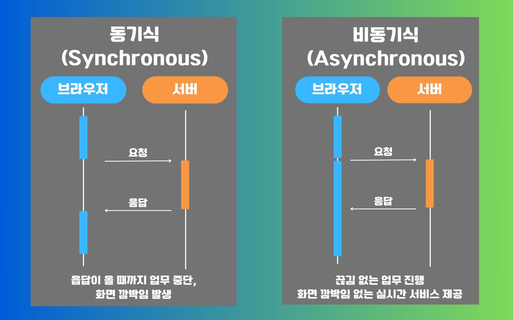

# Ajax란?
Asynchronous Javascript And Xml(비동기식 자바스크립트와 xml)

웹페이지의 전체 페이지를 새로 고치지 않고, 페이지의 일부분만을 서버에서 가지고 와서 ‘웹페이지 화면을 동적으로 변경하는 방식’
> 즉, 페이지를 새로고침하지 않고, 서버랑 데이터 주고받는 기술

#### 동기식 vs 비동기식
  
출처 : https://www.elancer.co.kr/blog/detail/182

- `비동기적 방식`은 동기적 방식과는 반대로 서버의 응답이 올 때까지 대기하지 않고, 서버의 데이터가 준비되는 동안에도 사용자가 웹페이지에서 다른 작업을 수행할 수 있는 방식을 의미합니다.
- `동기적 방식`은 요청을 하고 응답이 올 때까지 다른 일을 하지 못하고 응답이 완료되어야 다른 처리를 진행할 수 있습니다. 


## Ajax 사용법 (with jQuery)

```js
$.ajax({
  url: "요청할 URL",
  method: "GET", // 혹은 "POST"
  dataType: "json",
  success: function(response){
    console.log(response);
  },
  error: function(error){
    console.log("에러 발생:", error);
  }
});
```

### 실습해보기1 : 데이터를 가져와서 알림창에 표시하기
`pracitce02.html` 을 따라쳐보면서 ajax를 익혀볼까요?

### 실습해보기2 : HTML에 Ajax 데이터를 적용해볼까요?
`practice03.html` 을 따라쳐보면서 jquery와 ajax를 익혀볼까요?


### GET / POST
👉 GET:
- 데이터를 **주소(URL)**에 붙여서 보냄
- 주소에 보임
- 조회할 때 사용

👉 POST:
- 데이터를 숨겨서(body) 보냄
- 주소에 안 보임
- 등록/저장할 때 사용
```js
$.ajax({
  url: "https://example.com/api/save",
  method: "POST",
  data: { name: "홍길동", age: 25 },
  success: function(result){
    console.log(result);
  }
});
```

비유하자면
“GET은 주소에 글자 써서 보내는 거  
POST는 봉투 안에 편지 넣어서 보내는 거”