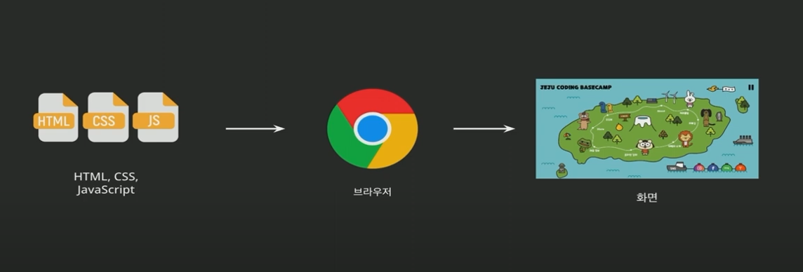
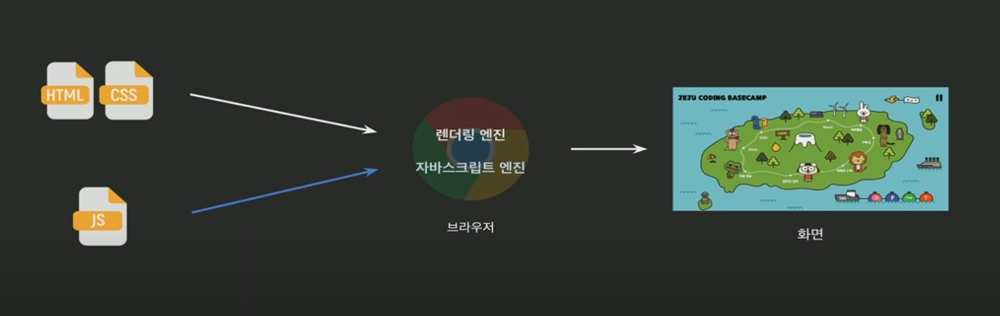
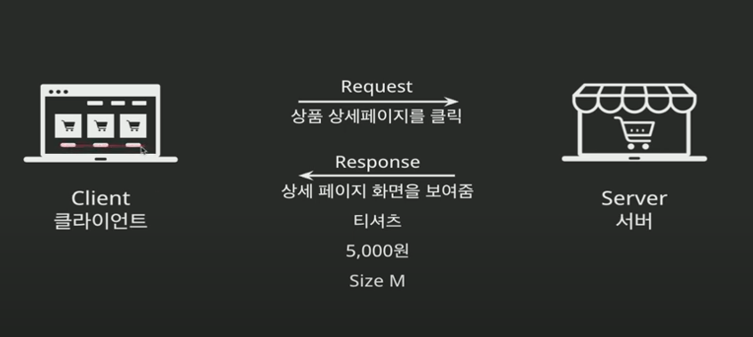
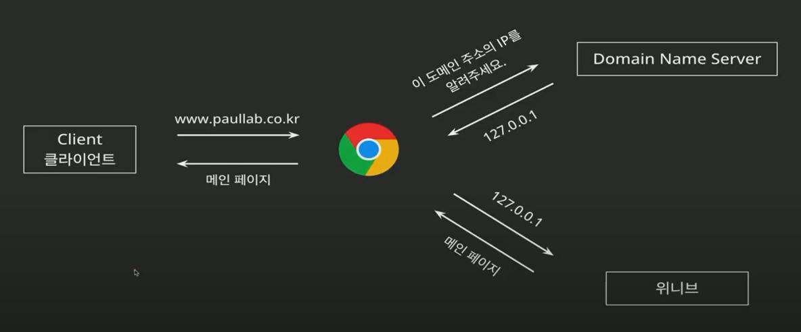

# Node.js

## Node.js란?
노드JS는 구글 크롬 브라우저에서 사용하는 Chrome V8 Javascript 엔진으로 구됭되는 Javascript 런타임입니다.

- 원래 javascript는 웹 브라우저 안에서만 동작했습니다.
- 그런데 노드JS 덕분에 Javascript를 브라우저 밖, 즉 컴퓨터 서버에서도 실행할 수 있게 되었어요.
- 그래서 웹사이트의 **뒷단(백엔드)**도 자바스크립트로 만들 수 있습니다.


### Chrome V8 엔진?
- 크롬 브라우저가 자바스크립트를 빠르게 실행시키기 위해 만든 엔진(실행기)
- 이걸 가져와서 Node.js 안에 붙여 넣은것!
- 이 엔진이 개발되고나서 자바스크립트의 속도가 비약적으로 빨라졌다.


### 런타임?
- 프로그램이 실제로 실행되는 환경
- Javascript를 브라우저가 아닌 서버에서 실행하게 해주는 환경이 바로 NodeJS

==> 원래 자바스크립트는 브라우저라는 런타임만 가졌는데 NodeJS가 개발되면서 브라우저 이외에 개발할 수 있는 런타임이 탄생.


## Node.js의 이해 - 웹 브라우저의 동작 과정
  
일반적으로 우리가 보는 웹페이지 화면은 HTML, CSS, Javascript로 이루어져있습니다.  
이 세가지는 브라우저를 통해서 해석이 된 다음에 화면으로 출력하게 되는데, 그 과정을 **랜더링**이라고 표현합니다.

  
브라우저 내에서 해석 차이
- HTML, CSS => 렌더링 엔진을 통해 해석
- JS => 자바스크립트엔진(V8)을 통해서 해석

> javascript는 HTML 요소를 조작하기 위한 언어.


## Node.js의 이해 - 특징 : 확장성
`NPM(Node Package Manager)`  
: Node.js의 패키지를 관리할 수 있는 도구  

다양한 내부, 외부 모듈(패키지) 제공 => 필요한 기능들이 미리 구현되어 있는 경우가 많음


## Node.js 설치하기

https://nodejs.org/ko

> LTS(Long Term Support) : 장기 지원 버전이라고 불리며 오랜 기간 걸쳐 해당 버전을 지원한다


## Node.js 설치하고 OPEN

### 1. 연습 프로젝트 소스를 넣을 폴더를 생성하고 VSCODE로 열어줍니다.

### 2. REPL 기능을 사용해봅니다.
- Read Evaluation Print Loop를 의미 => 코드를 즉석에서 바로 실행하고 그 결과를 확인할 수 있는 환경
- terminal > new terminal 
- `node` 입력 : REPL 모드 시작
    - `console.log` 입력해보기
    - `.editor` : 여러줄 입력 가능 (ctl+d로 종료)
    - `.exit` 입력시 터미널 종료 

```javascript 
console.time('시작')
for(let i=0; i<10; i++) {
    console.log(i)
}
console.timeEnd('시작')
```
    
- repl 모드: 코드를 바로 실행
- JS파일 모드 : 특정 기능을 담은 하나의 파일 실행

### 3. JS 파일을 생성해봅시다
- `001_hello_world.js` 생성
- hello world를 출력하는 스크립트 만들기
- 터미널에 `node 파일명`으로 실행

### 4. 서버 구축하기

#### 서버 동작 방식


#### URL
URL은 우리가 인터넷에서 원하는 정보를 찾기 위해 입력하는 주소
```
https://www.google.com/search?q=nodejs
```
| 부분               | 설명                                        |
| ---------------- | ----------------------------------------- |
| `https://`       | **어떻게 연결할지 방식** (보통 https를 씀. http보다 안전) |
| `www.google.com` | **어디로 갈지, 즉 웹사이트 이름 (도메인)**               |
| `/search`        | **어떤 페이지로 갈지** (주소 안의 경로)                 |
| `?q=nodejs`      | **찾을 내용이나 조건** (검색어 등: 이건 "쿼리 스트링"이라 고 합니다)  |

#### DNS
DNS(Domain Name System)는 도메인 이름을 컴퓨터가 이해할 수 있는 IP 주소로 바꿔주는 전화번호부 같은 시스템입니다


1. 사용자가 브라우저에 www.naver.com 입력
2. DNS가 www.naver.com을 서버의 IP 주소(223.130.195.200 등)로 바꿔줌
3. 브라우저는 그 IP로 연결 → 웹사이트가 열림!

흐름
```
사용자: www.example.com 입력
  ↓
브라우저 → DNS 서버에게 물어봄
  ↓
DNS: "그거 123.456.789.1이야"
  ↓
브라우저는 그 IP 주소로 Node.js 서버에 연결
  ↓
서버가 응답: "안녕하세요~"
```

#### CJS 스타일로 서버 구축하기 
- `server.js` 작성하기
- `node server.js` 실행
- http://localhost:3000/ 로 확인 
- ctrl + c : 종료

> 이 코드는 Node.js를 이용해, 브라우저가 http://localhost:3000으로 요청하면 "Hello node.js"라는 텍스트를 보여주는 서버를 만든 것입니다

##### `const http = require('http');`
- 노드JS에 내장된 http 모듈을 가져왔습니다.
- 웹 서버를 만들기 위한 기본 도구

##### `http.createServer((req, res) => {...})`
- 서버를 만드는 함수
- req : 클라이언트 요청 정보
- res : 서버 응답을 보낼 때 사용하는 객체

##### `res.writeHead(200, {'Content-Type': 'text/plain'});`
- 응답 헤더 설정 
    - 200 : 성공 상태 코드
    - 'Content-Type': 'text/plain': 응답이 일반 텍스트라는 의미

##### `res.write('Hello node.js');`
- 실제 응답 본문에 들어갈 텍스트 작성

##### `res.end();`
- 응답 종료

##### `server.listen(3000, () => {...})`
- 이 서버를 3000번 포트에서 대기하도록 설정
- 브라우저에서 http://localhost:3000 입력 시 이 서버에 요청이 들어감
- console.log()는 터미널에 메시지를 출력함


#### ESM 스타일로 서버 구축하기 (요즘 스타일!)
- terminal에서 `my_app`폴더로 이동
- `npm init` : 새로운 프로젝트를 만들겠다 
    - package_name, version 그대로 enter
    - description : my first node app
    - entry point (노드JS가 돌아가는 메인 파일을 정하는 것) 그대로 enter
- `my_app/package.json` 확인 가능
    - package.json은 프로잭트의 요약본이라고 생각하시면 됩니다.
- npm을 사용해서 외부 모듈 사용하기
    - terminal에 `npm install express`를 통해 설치
- `node_modules` 폴더 확인
    - express가 설치가 되면서, 누군가 만들어놓은 파일, 코드 덩어리를 가져와서 사용용    
    - `package.json`에 dependencies 확인
- `package.json`에서 하단 코드 삽입
    ```js
    "type":"module"
    ```
    - commonjs : cjs로 사용하겠다  
    - module : esm 모듈을 사용하겠다
- `index.js`생성 
```js
import { createServer } from 'http';

const server = createServer((req, res) => {
    res.writeHead(200, {'Content-Type' : 'text/plain'});
    res.write('Hello node.js');
    res.end();
});

server.listen(3000, ()=> {
    console.log('Server is listening on port 3000');
});
```

#### `import { createServer } from 'http';`
ESM 방식의 모듈 불러오기 (CommonJS의 require('http') 대신)  
http 모듈에서 createServer 함수만 선택적으로 가져오는 문법

